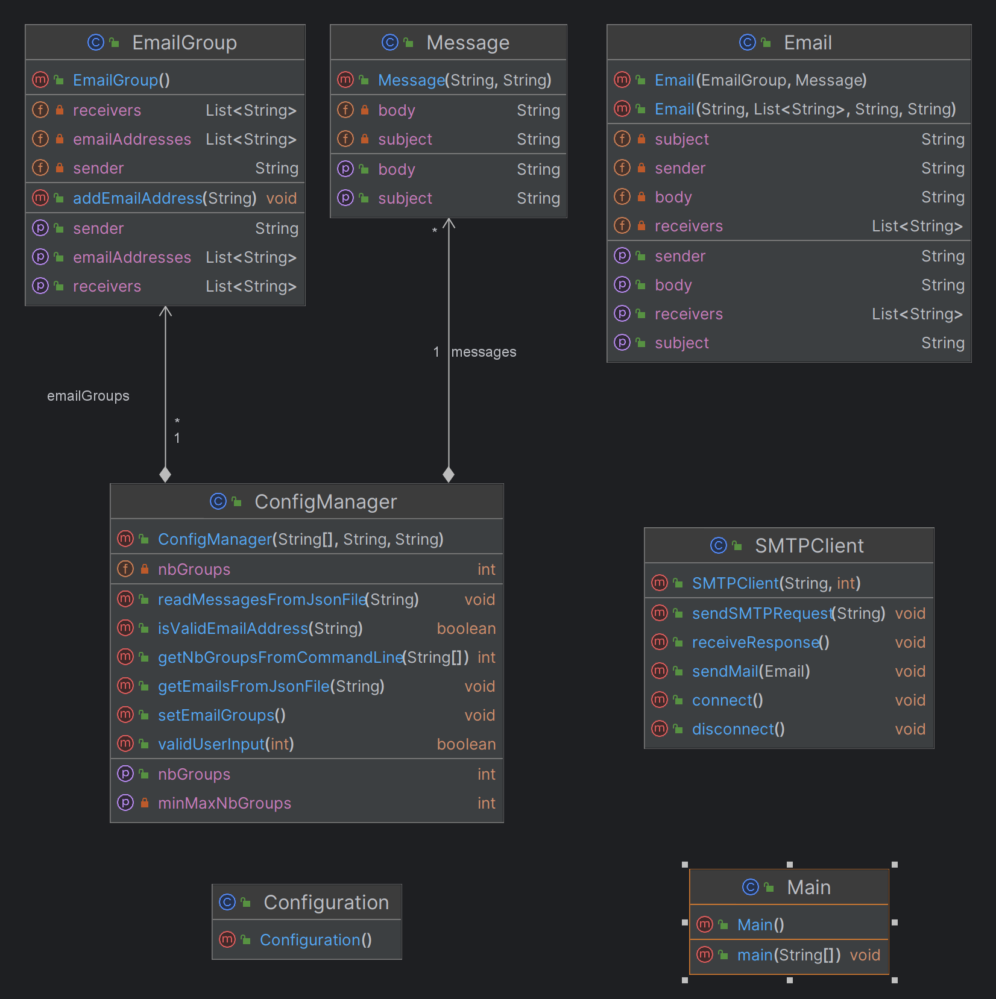

# Rapport laboratoire 4 : SMTP

## Introduction

Le projet a pour but d'automatiser l'envoi de courriers électroniques à l'aide d'un client SMTP. Il comprend
plusieurs composants essentiels tels que les classes `Email`, `EmailGroup`, `Message`, `SMTPClient`, `ConfigManager` et
`Configuration`.
L'objectif global est de simplifier le processus d'envoi de courriels en regroupant les destinataires en groupes et en
utilisant des messages préconfigurés.

## MockMock

### Description

MockMock appartient à la catégorie des serveurs conçus pour reproduire un service réel. Dans notre contexte, nous
l'utilisons pour simuler un serveur SMTP. La version de MockMock que nous avons adoptée n'est pas
la version originale ; il s'agit d'un clone provenant d'un dépôt [GitHub MailDev](https://github.com/maildev/maildev).

Cette solution nous permet de voir les différentes parties des courriers électroniques que nous envoyons, notamment
les en-têtes, le sujet et le corps.

### Configuration

#### Serveur MailDev

Afin d'acquérir et exécuter l'image du serveur MailDev, il suffit lancer ces deux commandes

    docker pull maildev/maildev
    docker run -d -p 1080:1080 -p 1025:1025 maildev/maildev

(Cf [MailDev](https://github.com/maildev/maildev) )

Il est possible de confirmer que le conteneur s'exécute correctement en consultat la liste des container. Le statut "
running" doit apparaître

    docker ps -a

Pour accéder à l'interface web fournie par MailDev, il suffit de se rendre à l'adresse `localhost:8080` dans un
navigateur. Sur cette page, vous pourrez consulter tous les e-mails reçus par le serveur et examiner en détail leurs
informations. Le serveur SMTP est accessible sur localhost:1025.

#### Client SMTP

Afin de lancer notre programme, il vous faut d'abord cloner ce dépot Git

    git clone https://github.com/CamilleKoestli/dai-lab-smtp.git

Puis allez sur ce dossier et exécutez la commande suivante afin de compiler le programme avec Maven

    mvn package

Ensuite exécutez l'application en lançant le fichier .jar qui se trouve dans le sous-dossier target.

    java -jar .\target\App-1.0.jar

La console vous demandera d'entrer le nombre de groupe auxquels vous voulez envoyer des emails. Chaque groupe possède de
2 à 5 addresses mails. La première étant celle de l'expéditeur et les autres seront les destinataires.

#### Project configuration

Configuration du Projet : Ouvrez le projet dans votre environnement de développement Java préféré. Assurez-vous que les
bibliothèques nécessaires sont présentes.

Configuration des Fichiers d'Entrée : Deux fichiers sont disponibles comme exemple: messages.json et victims.json.
Afin d'en utiliser d'autres, il vous suffit de modifier les chemins d'accès en initialisant les variables `VICTIMS_FILE`
et `MESSAGES_FILE` dans la classe `Configuration` avec les chemins des fichiers désirés.
Note: Il est important que les fichiers aient le même schéma que ceux donnés afin que `ConfigManager` puisse extraire
les données nécessaires.

Exécution du Projet : Exécutez la classe Main. Cela déclenchera la création d'objets Email à partir des groupes d'
e-mails et des messages fournis. Les courriers électroniques seront ensuite envoyés au serveur SMTP factice.

Visualisation des Résultats : Suivez la console pour voir les étapes du processus d'envoi de courriers électroniques, y
compris les réponses du serveur SMTP factice. Il est également possible de vérifier le bon fonctionnement de
l'application en accédant `localhost:8080` sur votre navigateur.

## Implémentation

### Diagramme UML

On peut séparer notre code en 4 parties :

- Partie SMTP : S'occupe de l'envoi des messages.
- Partie config : Récupère les propriétés et vérifie les entrées.
- Partie fileIO : Elle modélise le message, ainsi que les groupes de victimes et les expéditeurs.
- Partie Main : Entrée principale du programme.
  configuration for the email prank application.
- It reads messages and email groups from JSON files.

### Partie SMTP

- `Email`: Représente un courrier électronique avec un expéditeur, des destinataires, un sujet et un corps. Peut être
  créé à
  partir d'un groupe d'e-mails et d'un message.

- `EmailGroup`: Groupe d'e-mails avec un expéditeur et des destinataires. Peut être créé en lisant les adresses à partir
  d'un fichier.

- `Message`: Contient le sujet et le corps d'un message électronique.

- `SMTPClient`: Client SMTP pour envoyer des courriers électroniques. Gère la connexion au serveur SMTP, l'envoi de
  demandes
  SMTP et la réception des réponses.

### Partie Config

La partie Configuration de l'application est responsable de définir les paramètres constants utilisés dans l'ensemble du programme. Ces paramètres incluent des informations telles que le numéro de port du serveur SMTP, l'adresse du serveur, les chemins des fichiers JSON contenant les victimes et les messages, ainsi que des contraintes sur la tailledes groupes et le modèle d'adresse e-mail autorisé.

La classe `ConfigManager` centralise la gestion de la configuration de l'application. Elle fournit des structures de données prêtes à l'emploi pour les groupes d'e-mails et les messages. Ses principales responsabilités incluent la lecture, la validation et la création d'instances pour simplifier l'utilisation des données dans le reste de l'application.

### Partie Main

La partie Main de l'application est le point d'entrée principal. Elle est responsable de coordonner l'exécution du programme en instanciant les objets nécessaires, tels que ConfigManager et SMTPClient. La classe Main utilise ces objets pour récupérer la configuration, lire les groupes d'e-mails et les messages à partir des fichiers JSON, puis envoyer les e-mails en utilisant la partie SMTP de l'application. En cas d'erreur, elle gère les exceptions en affichant des messages d'erreur explicites.

## Exemple d'échange

### Exemple 1:

    ---- sending email -----
    S: 220 d2b2c2fe32c6 ESMTP
    C: ehlo 127.0.0.1
    S: 250-d2b2c2fe32c6 Nice to meet you, [192.168.65.1]
    S: 250-PIPELINING
    S: 250-8BITMIME
    S: 250 SMTPUTF8
    C: mail from:<hank@example.com>
    S: 250 Accepted
    C: rcpt to:<frank@example.com>
    S: 250 Accepted
    C: rcpt to:<isabel@example.com>
    S: 250 Accepted
    C: data
    S: 354 End data with <CR><LF>.<CR><LF>
    C: Content-Type: text/plain; charset=utf-8
    C: from:<hank@example.com>
    C: subject: Remerciements pour votre contribution
    C: Rebonjour,

    Nous voulions vous exprimer notre gratitude pour votre contribution exceptionnelle au projet. Votre travail a un impact significatif.

    Merci infiniment!
    C: .
    S: 250 Message queued as IPOpsD2B
    C: quit
    S: 221 Bye

### Exemple 2

L'application est capable de détecter la présences d'addresses mails invalides dans le fichier json donné et ne les prend pas en compte lors de l'envoi des messages.

    Invalid email address: 98.com
    Invalid email address: jaimedai.com
    Invalid email address:
    Enter the number of groups (between 2 and 5):

### Exemple 3

L'application effectue une vérification du nombre de groupes en fonction de quantité d'emails valides fournis et le nombre de groupes désirés afin d'assurer qu'un groupe ait toujours > 2 membres.

    Enter the number of groups (between 2 and 5): 6
    Enter the number of groups (between 2 and 5): Arguments non valides. Veuillez essayer à nouveau.
    4
    ---- sending email -----
    S: 220 d2b2c2fe32c6 ESMTP
    C: ehlo 127.0.0.1
    S: 250-d2b2c2fe32c6 Nice to meet you, [192.168.65.1]
    S: 250-PIPELINING
    S: 250-8BITMIME
    S: 250 SMTPUTF8

## Conclusion

Le projet fournit un moyen automatisé d'envoyer des courriers électroniques simulés à l'aide d'un serveur
SMTP. La séparation des responsabilités dans différentes classes facilite la maintenance et l'extension du
système.
